# Git
### Intro, flows & rules

 

Alberto Pesquera @ Brooktec

---

## Index

- Basic comands
- Advanced comands (?)
- SourceTree
- Flows and repositories
- Have to

---

## Purpose

+++

I hate git

+++

Now I hate it less

---

## The Basics

+++

<small>[Source](https://xkcd.com/1597)</small>

+++

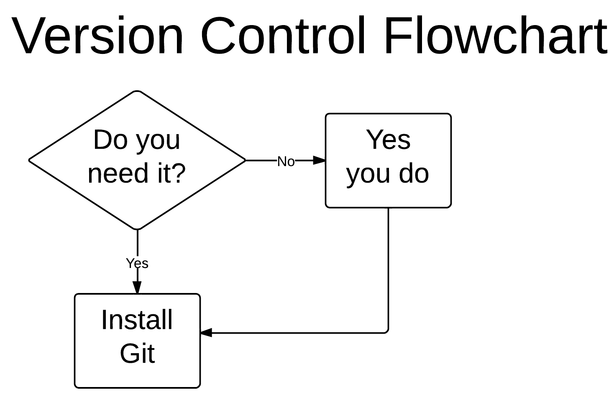

<small>[Source](https://www.reddit.com/r/ProgrammerHumor/comments/42cop5/do_you_need_git/)</small>

---

## Basic commands

- init
- status

+++

- add
- commit
- log

+++

- push
- pull
- remote
- clone

+++

- branch
- checkout

+++

- merge

<small>[Source](https://www.reddit.com/r/ProgrammerHumor/comments/6eejqt/git_merge_in_general/)</small>

---

### Some options and scenarios

- git remote add origin https://...
- git checkout -b newbranch |
- git commit -m 'Initial commit' |
- git commit --amend |
  - (!) Changes history |
- git log --oneline --decorate --graph --all |

+++

- git push --force
- git push -f |
- sudo rm -rf / |
- Do not execute!! |

---

## Advanced commands (?)

- fetch
- tag
- config

+++

- diff
- clean
- stash

+++
- reset
  - (!) Changes history
- revert

+++

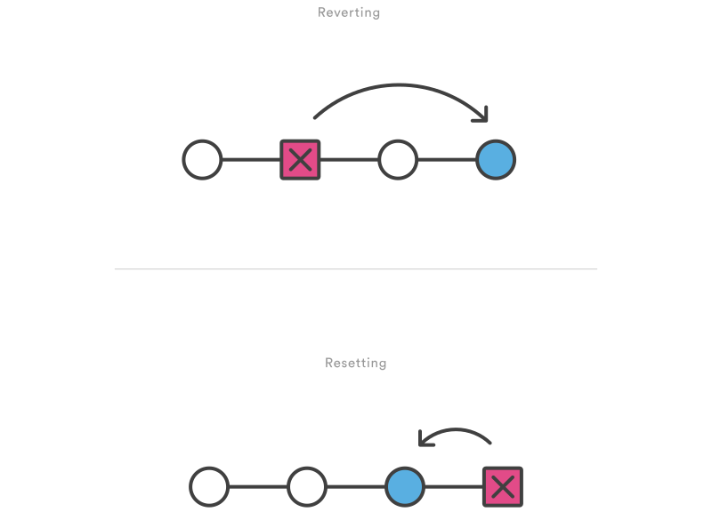

<small>[Source](https://www.atlassian.com/git/tutorials/undoing-changes)</small>

+++?image=assets/badreset.png

+++

- cherry-pick

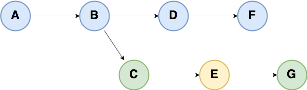

+++

- cherry-pick

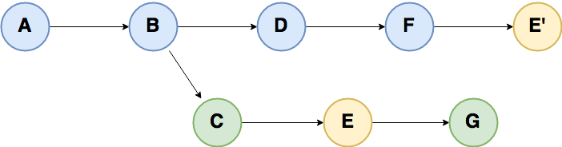

+++

- rebase
  - (!) Changes history

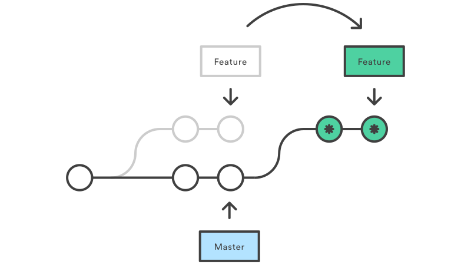

<small>[Source](https://www.atlassian.com/git/tutorials/rewriting-history/git-rebase)</small>

+++?image=assets/badrebase.png

+++

- blame

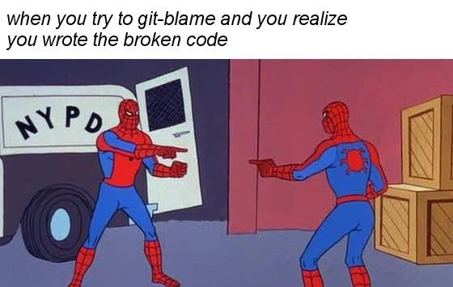

<small>[Source](https://www.reddit.com/r/ProgrammerHumor/comments/6p9syt/the_problem_with_git_blame/)</small>

---

### Some options and scenarios

- git clean -d
  - Directories
- git clean -X
  - Ignored files
- git clean -n
  - Dry run (First!!)
- git clean -f
  - Force (Second!!)

+++

- git stash save
- git stash pop

+++

- ~~git config --global alias.yolo 'push --force'~~
- git config --global alias.logg 'log --oneline --decorate --graph --all'

+++

- git reset --soft
- git reset --mixed
- git reset --hard

---

## Let's try!

+++?code=assets/tree.txt

+++

- git init
- git remote add origin https://...
- git add '*.php'
- git commit -m 'Initial commit'
- git add 'README.md'
- git commit -ammend
- git push origin master

+++

What if?
- git branch
- git log |
- git status |

+++

Actually...
- master
- 2 commits
- public/css/ and public/js/

---

## GUI

[https://git-scm.com/downloads/guis/](https://git-scm.com/downloads/guis/)

+++

- git push
- git push origin
- git push origin :
- git push origin :master
- git push origin master

+++

- SourceTree
- GitHub Desktop
- GitKraken
- SmartGit

+++

- IntelliJ
- Atom
- Visual Studio

---

### SourceTree config

- Tab General > Language > English
- Tab Git > Check "Do not fast-forward when merging, always create commit"
- Tab Git > Git-flow Version

+++

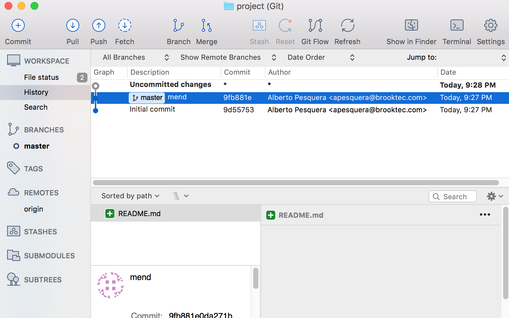

+++

Make sure this options:

- Tab Commit > DISABLED "Push to default/origin remote when committing"
- Tab Git > DISABLED "Use rebase instead of merge by default for traked branches"
- Tab Advanced > ENABLED "Keep backups on destructive oprations"
- Tab Advanced > DISABLED "Allow force push"

---

## Flows and repositories

+++

~~Guitar~~ GITar Hero

<small>[Source](https://www.reddit.com/r/ProgrammerHumor/comments/43ug8t/i_fucked_up_git_so_bad_it_turned_into_guitar_hero/)</small>

---

Git Flow

- [A successful Git branching model (By Vincent Driessen)](http://nvie.com/posts/a-successful-git-branching-model/)
- [Atlassian tutorial](https://www.atlassian.com/git/tutorials/comparing-workflows/gitflow-workflow)
- [Git-flow cheatsheet (infographic)](http://danielkummer.github.io/git-flow-cheatsheet/)

+++

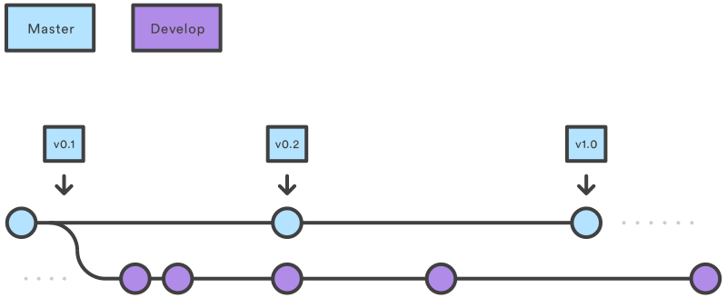

<small>[Source](https://www.atlassian.com/git/tutorials/comparing-workflows/gitflow-workflow)</small>

+++

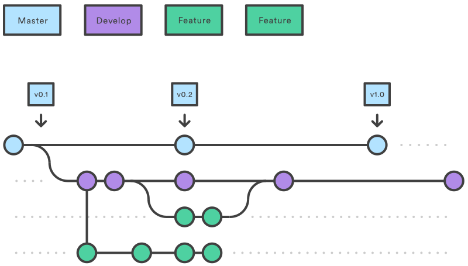

<small>[Source](https://www.atlassian.com/git/tutorials/comparing-workflows/gitflow-workflow)</small>

+++

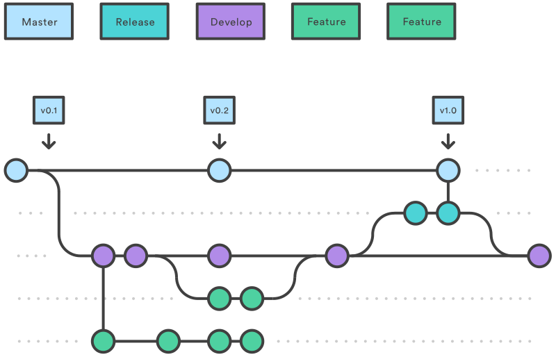

<small>[Source](https://www.atlassian.com/git/tutorials/comparing-workflows/gitflow-workflow)</small>

+++

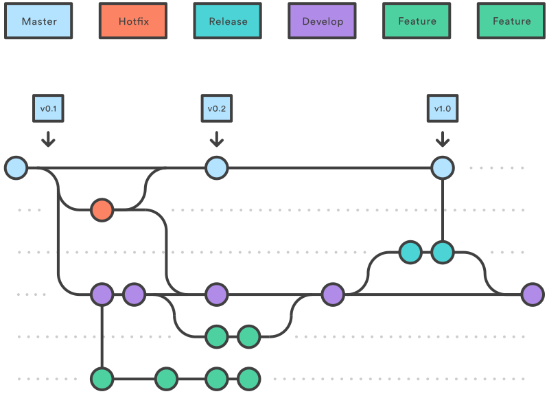

<small>[Source](https://www.atlassian.com/git/tutorials/comparing-workflows/gitflow-workflow)</small>

+++

The overall flow of Gitflow is:

<small>

- A develop branch is created from master
- A release branch is created from develop
- Feature branches are created from develop
- When a feature is complete it is merged into the develop branch
- When the release branch is done it is merged into develop and master
- If an issue in master is detected a hotfix branch is created from master
- Once the hotfix is complete it is merged to both develop and master

</small>

---

Central repository

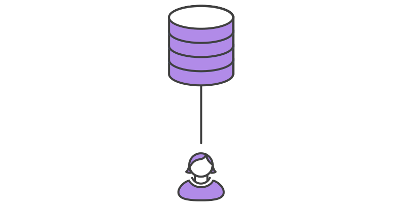

<small>[Source](https://www.atlassian.com/git/tutorials/comparing-workflows)</small>

+++

- Git Flow

---

Copy repository

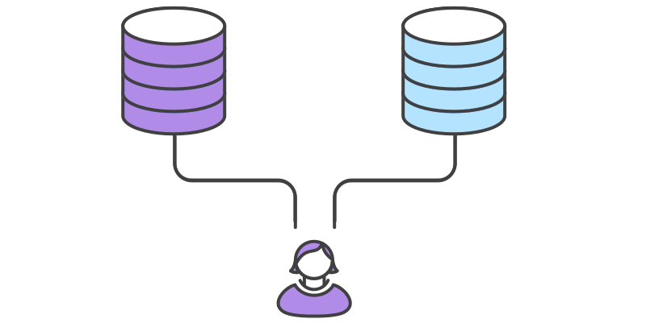

<small>[Source](https://www.atlassian.com/git/tutorials/comparing-workflows/forking-workflow)</small>

+++

- Remotes: origin and others
- Git Flow on origin
- Push all branches on origin
- Push certain branches on others

---

Fork repository

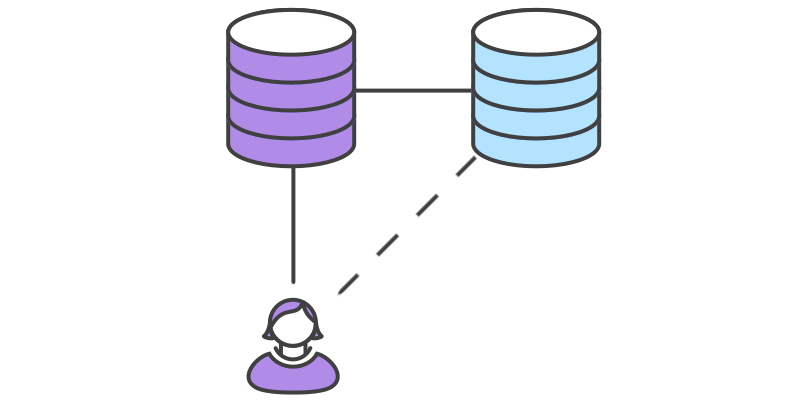

<small>[Source](https://www.atlassian.com/git/tutorials/comparing-workflows/forking-workflow)</small>

+++

- Remotes: origin (forked) and upstream (original)
- Forking Workflow with Git Flow
  - origin/master -> upstream/master
  - origin/develop -> upstream/develop
- Push on fork, then PR
- Branches ends when PR ends

---

## Have to

+++

- Up to date
  - Merge branch 'develop' of https://<repo> into develop
- Delete finished remote branches

+++

Short life branches

1 feature, 1 branch. 1 purpose, 1 commit.

+++

README.md

.gitignore

+++

Read README

Browse the branches (and read README!!)

+++

Simple, descriptive, English commits

Linus: 72 chars for word-wrap

[~~whatthecommit.com~~](http://whatthecommit.com/)

+++

Track (S)FTPs with a "server/" branch

Download code in hotfix/sync or feature/sync branch

+++

During development (v0.y.z), releases with code to show the customer

After first release (v1.0.0), production releases

---

## Next?

Inside git, rebase -i, submodules, subtrees, bare repo, orphans, hooks, bisect, gc...

---

Useful links

- [git-scm.com](https://git-scm.com/doc)
- [Flight rules for Git](https://github.com/k88hudson/git-flight-rules)
- [stackoverflow](https://stackoverflow.com/questions/tagged/git)
- Internet

---

You are ready to fly alone

<small>[Source](https://www.reddit.com/r/ProgrammerHumor/comments/7j9s5z/sometimes_you_just_gotta_git_push_f_and/)</small>

---

git commit -m 'The End'

---

## Any questions?
